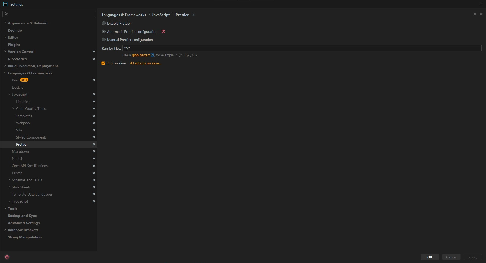

# Prettier

## مقدمه

Prettier
یه Package ئه که می‌تونیم با npm تو پروژه نصبش کنیم.

از Prettier برای Formatکردن کد استفاده میشه.
فرمت کد یعنی خصوصیات نوشتاری و ظاهری کد. به عنوان مثال:

- بین کلمات حداکثر یه Space می‌تونه بیاد.
- بین خطوط حداکثر یه Enter می‌تونه بیاد.
- ابتدای فایل نباید Enter اضافه وجود داشته باشه.
- انتهای فایل باید یه Enter اضافه وجود داشته باشه.
- ابتدای و انتهای پرانتز نباید Space اضافه وجود داشته باشه.
- ابتدا و انتهای تابع نباید Enter اضافه وجود داشته باشه.
- ...

رعایت‌کردن این مسائل به مرور زمان سخت میشه.
مثلاً ممکنه دستمون بخوره و به جای یه Space، دو تا Space بذاریم و حواسمون نباشه اصلاحش کنیم.
یا حتی ممکنه افراد مختلفی که تو تیم هستن، سلیقه‌ی متفاوتی داشته باشه.

به همین خاطر بهتره از ابزاری مثل Prettier استفاده کنیم به شکل خودکار کد رو فرمت کنه.

Prettier
یه ابزار Opinionated ئه.
به این معنا که سازنده‌ش، سلیقه‌ی خودش رو تو تنظیماتش اعمال کرده.
این موضوع برای کسایی که انفرادی کار میکنن یا برای تیم‌های نسبتاً کوچیک می‌تونه خیلی مناسب باشه.
چون صرفاً با نصب Prettier، تمام قواعد و قوانین همراهش تنظیم میشن.
اما برای تیم‌های خیلی بزرگ که استاندارد خاص خودشون رو دارن، ممکنه دست‌وپاگیر باشه.

البته میشه تنظیمات Prettier رو تا حد خوبی تغییر داد.
کافی یه فایلِ
`.prettierrc.json`
تو پوشه‌ی اصلی پروژه بسازید و هر موردی که دوست دارید رو تنظیم کنید.

بیشتر بدانیم:

- [What is Prettier?](https://prettier.io/docs/)
- [Prettier vs. Linters](https://prettier.io/docs/comparison)
- [Install](https://prettier.io/docs/install)
- [Configuring Prettier - Options](https://prettier.io/docs/options)
- [Configuring Prettier - Configuration File](https://prettier.io/docs/configuration)

## WebStorm

برای فعال کردن تنظیمات Prettier در WebStorm، مراحل زیر رو طی کنید:

1. از بالا-چپ روی علامت سه‌نقطه کلیک کنید تا منوی `File` باز شه.
2. رو `Settings` کلیک کنید تا پنجره‌ی تنظیمات باز شه.
3. عبارت `Prettier` رو توی باکس بالا-چپ جست‌وجو کنید.
4. از قسمت سمت چپ روی گزینه‌ی `Languages & Frameworks > JavaScript > Prettier` کلیک کنید.
5. از قسمت سمت راست `Automatic Prettier configuration` رو فعال کنید.
6. عبارت مقابل `Run for files` رو به عبارت زیر تغییر بدید:
   ```
   **/*
   ```
7. گزینه‌ی `Run on save` رو فعال کنید.


