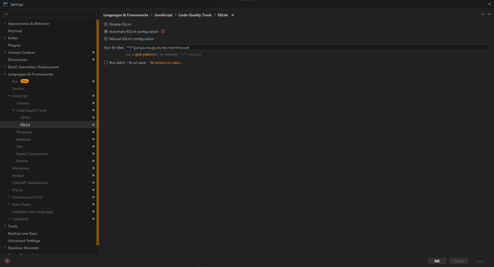

# ESLint

## مقدمه

ESLint
یه Linter ئه که می‌تونیم با npm تو پروژه نصبش کنیم.

Linterها
به ما کمک می‌کنن اشتباهات کدمون رو بفهمیم.
این اشتباهات به این معنا نیست که کدمون موقع اجرا خطا میده؛
بلکه به ما کمک می‌کنن از بروز باگ‌های پنهان جلوگیری کنیم.

مثلاً این کد رو در نظر بگیرید:

```typescript
let chiz = 23;
console.log(chiz);
```

اگه از ESLint تو پروژه استفاده کرده باشیم،
این خطا رو بهمون میده:

```text
ESLint: 'chiz' is never reassigned. Use 'const' instead. (prefer-const)
```

این که `chiz` رو با `let` تعریف کنیم، Error نیست؛
اما می‌تونه باعث بشه در آینده به مشکل بخوریم.
به عنوان مثال یه نفر ممکنه حواسش نباشه و `chiz` در تغییر بده؛
در صورتی که `chiz` باید همیشه ثابت و برابر با یه مقدار خاص باشه.

بیشتر بدانیم:

- [Getting Started with ESLint](https://eslint.org/docs/latest/use/getting-started)
- [Configure ESLint](https://eslint.org/docs/latest/use/configure/)

## WebStorm

برای فعال کردن تنظیمات ESLint در WebStorm، مراحل زیر رو طی کنید:

1. از بالا-چپ روی علامت سه‌نقطه کلیک کنید تا منوی `File` باز شه.
2. رو `Settings` کلیک کنید تا پنجره‌ی تنظیمات باز شه.
3. عبارت `ESLint` رو توی باکس بالا-چپ جست‌وجو کنید.
4. از قسمت سمت چپ روی گزینه‌ی `Languages & Frameworks > JavaScript > Code Quality Tools > ESLint` کلیک کنید.
5. از قسمت سمت راست `Automatic ESLint configuration` رو فعال کنید.

:::warning

پیشنهاد میشه گزینه‌ی `Run for files` رو تغییر ندید چون ESLint مجموعه‌ی مشخصی از فایل‌ها رو پشتیبانی می‌کنه.

:::

:::warning

پیشنهاد میشه گزینه‌ی `Run eslint --fix on save` رو تغییر ندید چون بعضاً حجم زیادی از کد رو تغییر میده و دنبال‌کردنش سخته.

:::


