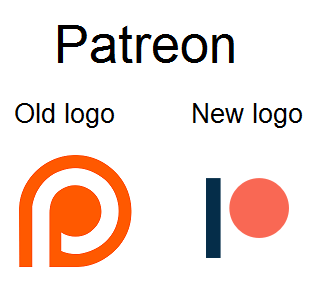

# اصول

تو این قسمت، اصول هفتگانه‌ی طراحی رو توضیح میدم که شناخت و رعایتشون حیاتیه.

:::info

توصیه می‌کنم همزمان با خوندن این مطلب،
[صفحۀ دمو](https://demos.codective.ir/ui-ux/)
رو هم ببینید تا به صورت دیداری و کاربردی با مفاهیم آشنا بشید.

:::

## White Space

المان‌ها باید فضای کافی برای تنفس داشته باشن.
هیچ‌وقت حجم زیادی از اطلاعات رو تو یه مکان کوچیک جا نکنید؛
چون کاربر نمی‌تونه به اندازه‌ی کافی تمرکز کنه و این مسئله براش عذاب‌آور میشه.

برای ایجاد White Space، راحت‌ترین کار استفاده از `margin` و `padding` ئه.
همچنین در `flexbox` و `grid` می‌تونید از `gap` استفاده کنید.

## Color

استفاده‌ی درست از رنگ‌های اهمیت ویژه‌ای داره.
هر رنگ نشون‌دهنده‌ی مجموعه‌ای از مفاهیمه که بهش روانشناسی رنگ‌ها گفته میشه.
به عنون مثال رنگ آبی نشونه‌ی صلح، آرامش، اعتماد، امنیت و... است؛
به همین خاطر خیلی از شرکت‌های بزرگ دنیا مثل Facebook و Twitter از این رنگ تو محصولاتشون استفاده می‌کنن.

### بیش از چند رنگ

همچنین وقتی که بخواید بیش از یه رنگ داشته باشید،
باید دقت کنید که رنگ‌های انتخابی شما همدیگه رو تکمیل کنن.
اگه از دو رنگ استفاده می‌کنید، معمولاً توصیه میشه رنگ‌های متضاد رو انتخاب کنید.
به‌عنوان مثال اگه رنگ اول شما آبیه، رنگ دوم رو می‌تونید نارنجی بذارید.

تو پوستر خیلی از فیلم‌ها این موضوع رو میشه مشاهده کرد:

### ابزار

برای انتخاب رنگ‌بندی، سایت
[Adobe Color](https://color.adobe.com/create/color-wheel)
رو پیشنهاد می‌کنم.
اول از سمت چپ، نوع قالب رنگی رو مشخص کنید،
بعد با استفاده از Color Wheel در وسط صفحه، رنگ اصلی رو انتخاب کنید.
می‌بینید که Adobe، باقی رنگ‌ها رو به طور خودکار در اختیار شما قرار میده.

همچنین از این ابزارها برای ساخت قالب رنگی می‌تونید استفاده کنید:

- [Coolors](https://coolors.co/)
- [Canva - Colors](https://www.canva.com/colors/)
- [Flat UI Colors 2](https://flatuicolors.com/)
- [Colorsinspo](https://colorsinspo.com/)
- [uiGradients](https://uigradients.com/)
- [Flatuicolorpicker](https://www.flatuicolorpicker.com/)

بیشتر بدانیم:

- [The Know It All Guide To Color Psychology In Marketing + The Best Hex Chart](https://coschedule.com/blog/color-psychology-marketing)
- [Color Psychology in Marketing and Branding is All About Context](https://www.helpscout.com/blog/psychology-of-color/)

## Contrast

Contrast
یعنی تضاد بین رنگ‌ها.
به‌عنوان مثال اگه یه دکمه داشته باشیم،
میشه تضاد بین رنگ نوشته و رنگ پس‌زمینه‌ی دکمه رو در نظر گرفت.

### WCAG

استانداردی به اسم WCAG وجود داره که تعیین می‌کنه چه نسبتی بین نوشته و پس‌زمینه باید وجود داشته باشه.
این استاندارد شامل دو حالت AA و AAA ئه که حالت دوم رتبه‌بندی بهتری داره و در صورت امکان باید اون رو در نظر گرفت.

همچینن میزان Contrast به اندازه‌ی متن هم وابسته‌ست.
به‌عنوان مثال تو رتبه‌بندی AA اگه اندازه‌ی متن معمولی باشه، نسبت Contrast باید حداقل 4.5 به 1 باشه؛
اما اگه اندازه‌ی متن بزرگ باشه، این نسبت میتونه تا 3 به 1 کاهش پیدا کند.

برای بدست آوردن این نسبت می‌تونید از ابزارهای زیر استفاده کنید:

- [Colour Contrast Checker](https://colourcontrast.cc/)
- [Adobe Contrast Checker](https://color.adobe.com/create/color-contrast-analyzer)

بیشتر بدانیم:

- [MDN - Color contrast](https://developer.mozilla.org/en-US/docs/Web/Accessibility/Understanding_WCAG/Perceivable/Color_contrast)
- [The Myths of Color Contrast Accessibility](https://uxmovement.com/buttons/the-myths-of-color-contrast-accessibility/)
- [How to use contrast in UI Design](https://blog.prototypr.io/how-contrast-works-in-ui-design-21bf75a5a2bf)

## Visual Hierarchy

زمانی که کاربر وارد صفحه میشه، با چشماش المان‌های صفحه رو به ترتیب بررسی می‌کنه
که به این رده‌بندی، Visual Hierarchy گفته میشه.
همیشه المان‌های مهم‌تر باید رتبه‌ی بالاتری تو این رده‌بندی داشته باشن.
به‌عنوان مثال تیتر یه صفحه از اهمیت بالایی برخورداره اما تاریخ نگارشش ممکنه خیلی مهم نباشه.

برای بالا بردن رتبه‌ی یه المان و جلب توجه کاربر از موارد متعددی مثل سایز و وزن فونت، فضای تنفس، رنگ و انیمیشن می‌تونید استفاده کنید.

بیشتر بدانیم:

- [6 principles of visual hierarchy for designers](https://en.99designs.nl/blog/tips/6-principles-of-visual-hierarchy/)
- [Key Principles of Visual Hierarchy in UX Design](https://xd.adobe.com/ideas/process/information-architecture/visual-hierarchy-principles-examples/)

## Alignment

Alignment
یا تراز بودن، به شدت ارتباط تنگاتنگی با Visual Hierarchy داره
و اگه بشه از این دو به درستی استفاده کرد،
شاهد یه UI و UX حرفه‌ای خواهیم بود.

المان‌هایی که Contrast بالایی دارن، باید تو یه ستون نسبت به المان‌های بالا و پایینشون قرار داشته باشن.
به این ترتیب میشه یه ساختار مشخص ایجاد و به بهبود تمرکز کاربر کمک کرد.

### وسط‌چین

در اکثر مواقع توصیه نمی‌کنیم المان‌ها رو به صورت وسط‌چین تنظیم کنید؛
مگر اینکه فضای کوچیکی مثل صفحه نمایش تلفن همراه داشته باشیم.
همچنین در موارد محدود می‌تونید Hero Section رو به این شکل انتخاب کنید.
اما بیشتر اوقات بهتره با توجه به RTL یا LTR بودن سایت، همون جهت رو برای تراز کردن المان‌ها انتخاب کنید.

بیشتر بدانیم:

- [Principles of Design: Alignment](https://uxengineer.com/principles-of-design/alignment/)
- [Alignment Principle in Design: Importance & Examples](https://ux360.design/alignment-principle-design/)

## Typography

تایپوگرافی چیزی فراتر از انتخاب یه فونت مناسبه.
تمام سایت‌ها از متن استفاده می‌کنن.
این متن میتونه در جایی مثل تیتر، پاراگراف یا دکمه استفاده شه.
بنابراین تنظیم‌کردن خصوصیات این متون باید به بهترین شکل ممکن انجام شه.

### چند فونت در یک سایت

در کل پروژه فقط از یک فونت استفاده کنید.
کمتر پیش میاد استفاده از دو فونت مجزا، نتیجه‌ی مطلوبی داشته باشه؛
مخصوصاً برای سایت‌های فارسی.
اگه قسمتی از سایت شما فارسی و قسمت دیگه انگلیسیه، از دو فونت برای اون‌ها استفاده نکنید؛
بلکه دنبال فونتی بگردید که هر دو رو به‌خوبی نشون بده.

من فونت‌های فارسی رایگان زیر رو پیشنهاد میکنم:

- [وزیرمتن](https://fonts.google.com/specimen/Vazirmatn)
- [شبنم](https://rastikerdar.github.io/shabnam-font/)
- [صمیم](http://rastikerdar.github.io/samim-font/)
- [گندم](http://rastikerdar.github.io/gandom-font/)

### طول خط

برای پاراگراف‌ها و متن‌های طولانی توصیه میشه با توجه به نوع مطلب،
عرض خطوط بین 40 تا 70 کاراکتر باشه.
این مسئله به‌شدت به خوانایی متن کمک می‌کنه.

بیشتر بدانیم:

- [10 Principles for Typography in UI Design](https://uxdesign.cc/10-principles-for-typography-usage-in-ui-design-a8f038f43ffd)
- [8 Rules for Perfect Typography in UI](https://blog.prototypr.io/8-rules-for-perfect-typography-in-ui-21b37f6f23ce)
- [Typography in UI Design](https://xd.adobe.com/ideas/process/ui-design/typography-in-ui-design/)

## Simplicity

تا جایی که می‌تونید سعی کنید ذهن کاربر رو با افکت‌های عجیب و غریب مشغول نکنید.
سعی کنید همه چیز کاملاً ساده، گویا و بدونِ حشو باشه.
به‌کارگیری افکتی که به تازگی اون رو یاد گرفتید ممکنه برای خودتون خیلی جذّاب باشه،
اما برای اکثر کاربرها صرفاً بار اضافه و امتیاز منفی محسوب میشه.

### سایه

از سایه‌ها فقط و فقط جایی که بهش احتیاج دارید استفاده کنید.

### Border و Outline

پیشنهاد می‌کنم از `border` و `outline` استفاده نکنید،
اما اگه اصرار به این کار دارید، نوع، اندازه و رنگشون باید طوری انتخاب شه که توجه زیادی رو جلب نکنه.

### Gradient

Gradient
ها فقط زمانی خوب به نظر میان که بی‌نقص پیاده‌سازی شده باشن؛
بنابراین به طور کلی بهتره به جاشون از رنگ‌های Solid استفاده کنید.

### افراط

از طرفی باید دقت کنید که طرح شما Over-simplified نباشه.
این اتفاق سر خیلی از لوگوها اومده و کاربرها از این موضوع ناراضی‌ان.
همه چیز باید به اندازه باشه تا بهترین UI و UX حاصل بشه.

بیشتر بدانیم:

- [Why Simplicity is so Incredibly Important in UX Design](https://careerfoundry.com/en/blog/ux-design/how-important-is-simplicity-in-ux-design/)
- [False Simplicity in UI Design: Simple is not always better](https://tomkenny.design/articles/false-simplicity)
